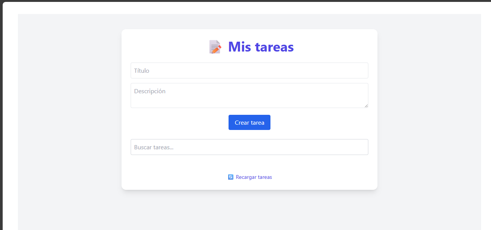
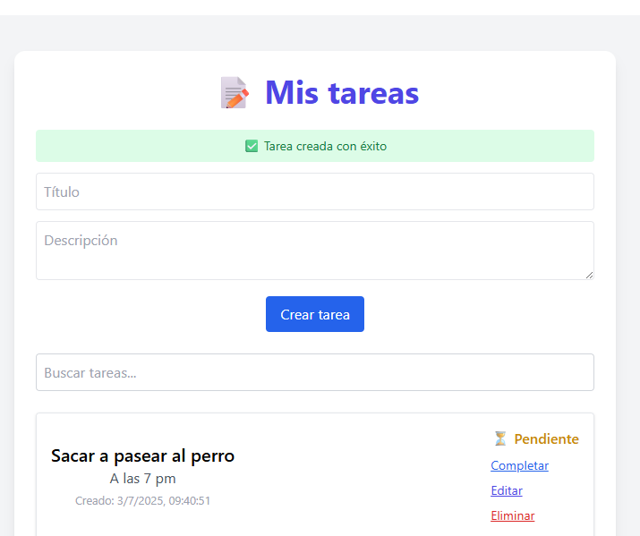
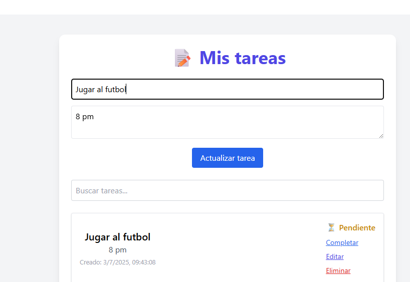
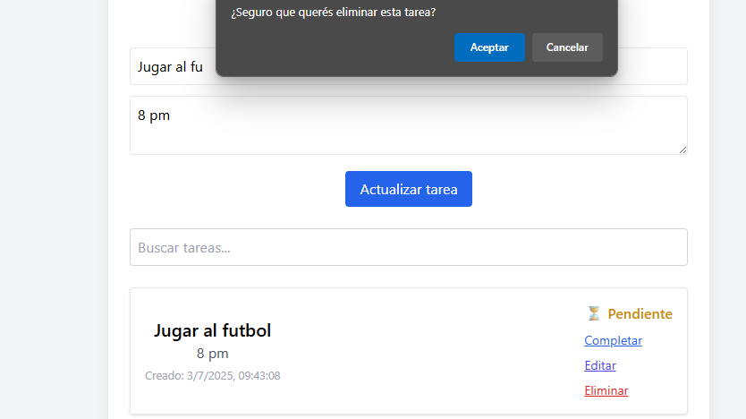
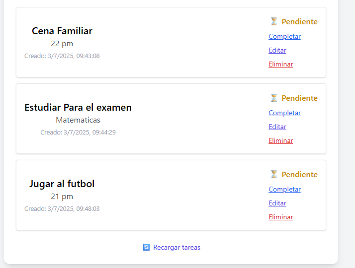
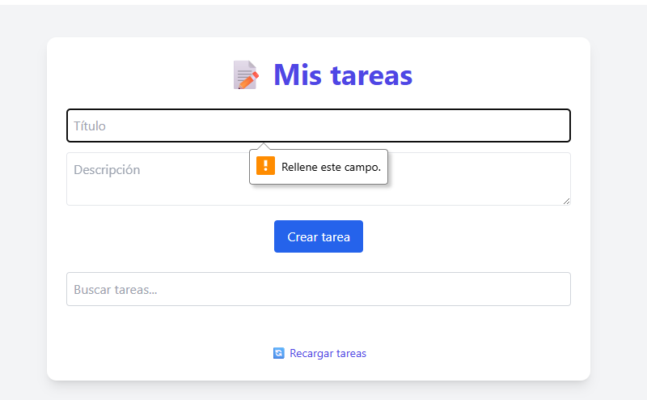
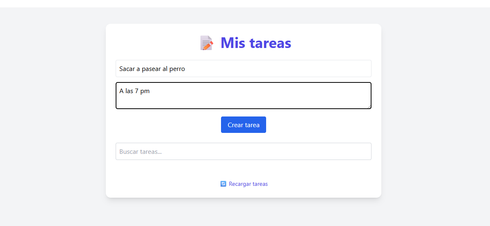
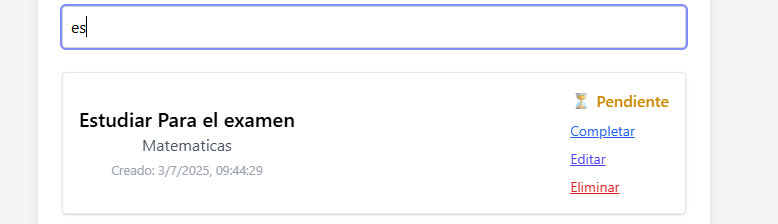

# 📝 ToDo App – Challenge ForIT 2025

Aplicación de lista de tareas desarrollada como parte del proceso de ingreso a la Academia ForIT 2025. Implementa funcionalidades CRUD completas, backend con Express y SQLite, y frontend moderno con React + TailwindCSS.

---

## 🚀 Funcionalidades principales

- Crear, leer, actualizar y eliminar tareas
- Marcar tareas como completadas o pendientes
- Búsqueda por título o descripción
- Formulario para editar tareas
- Estilo moderno y responsive con Tailwind

---

## 🧱 Estructura del proyecto

todoList_ForIT/
├── backend/
│ ├── app.js
│ ├── controllers/
│ ├── db/
│ ├── routes/
│ ├── data/
│ └── .env
├── frontend/
│ ├── src/
│ │ ├── components/
│ │ └── pages/
│ └── index.html
└── README.md

yaml
Copiar
Editar

---

## ⚙️ Cómo ejecutar localmente

### 🔧 Requisitos

- Node.js 18 o superior
- npm

### ▶️ 1. Clonar el repositorio

```bash
git clone https://github.com/TU-USUARIO/todoList_ForIT.git
cd todoList_ForIT
🛠️ 2. Backend (API)
bash
Copiar
Editar
cd backend
npm install
touch .env
echo "PORT=3001" > .env
node db/init.js  
npm run dev      
💻 3. Frontend (React)
En otra terminal:

bash
Copiar
Editar
cd frontend
npm install
npm run dev      

🖼️ Capturas de pantalla

🏠 Pantalla principal

✅ Tarea completada

✏️ Edición de tareas


Eliminar Tarea


Lista de Tareas


Validacion de Formulario


Creacion de una tarea


Filtrar Tarea



🧪 Tecnologías utilizadas

Frontend: React + Vite, Tailwind CSS
Backend: Node.js, Express
Base de datos: SQLite (con sqlite3 y sqlite)
Estado: React Hooks (useState, useEffect)

🎯 Bonus implementados

 Persistencia en SQLite
 Diseño con TailwindCSS
 Modularización de backend (controllers, db, routes)
 Filtros de búsqueda
 Feedback visual (mensajes de éxito/error)
 Buen uso de ramas Git (dev, feature/*)

👤 Autor

Nelson David Salto
Desarrollador Full Stack Jr
